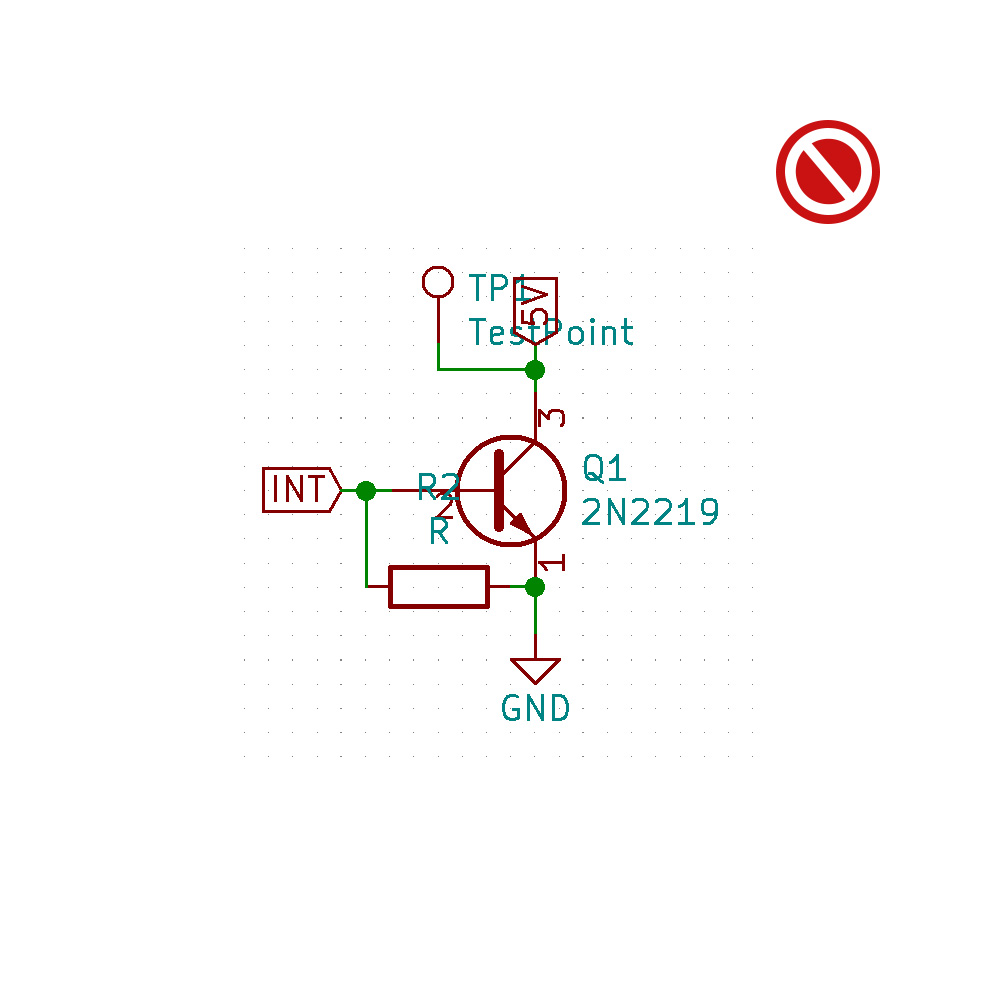
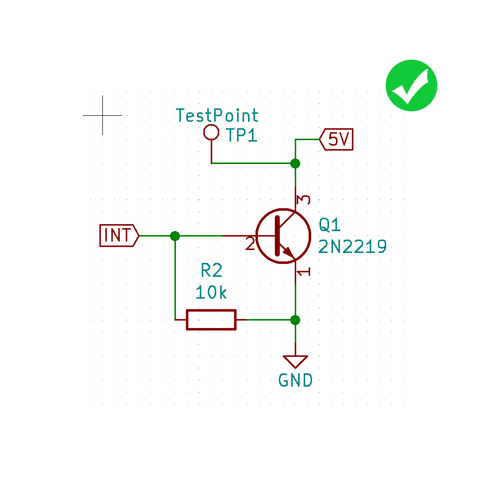
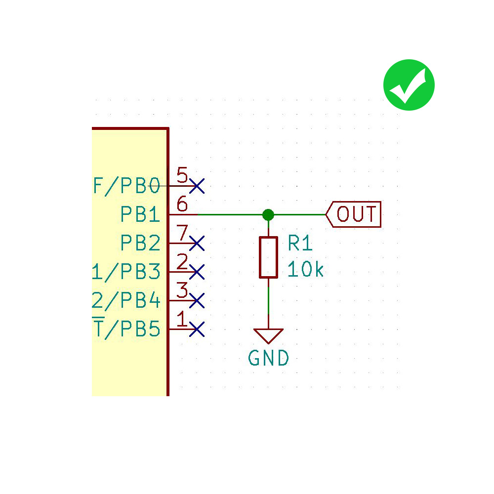
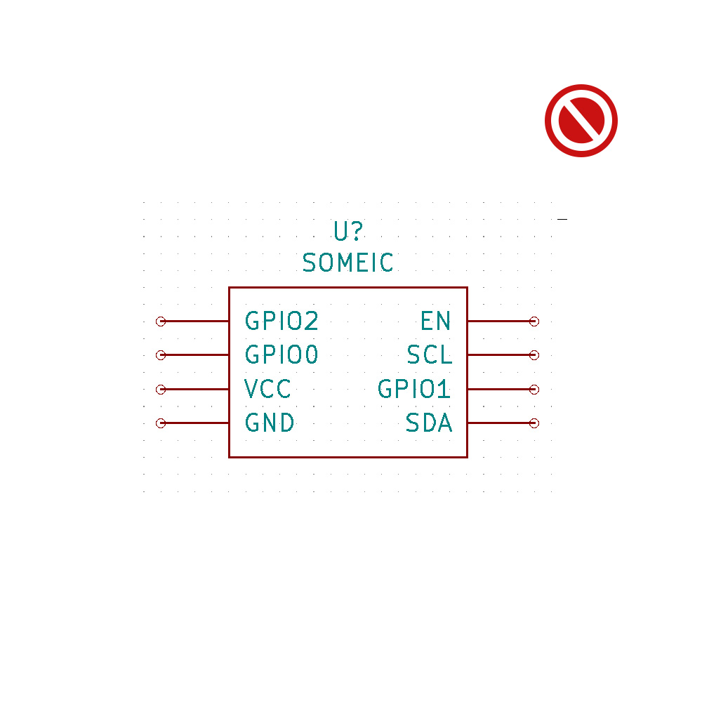
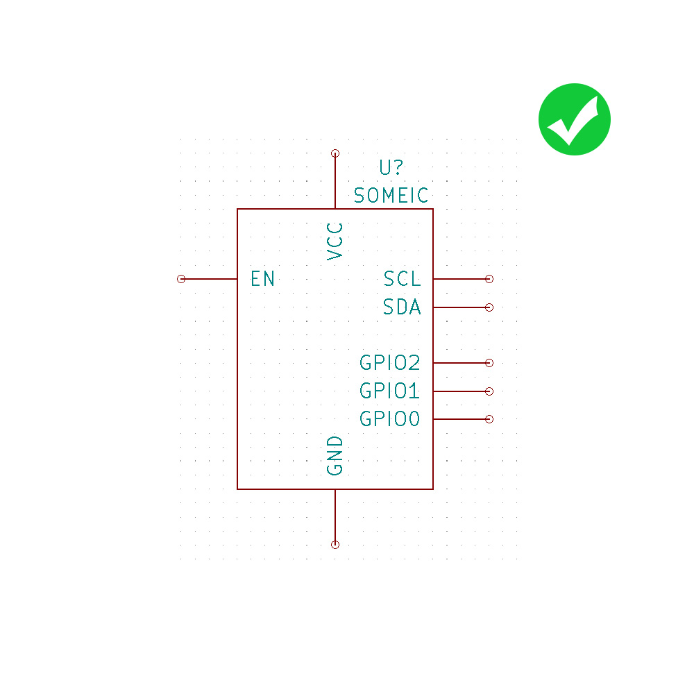

Guidelines
======================================

Here you can find a bunch of guidelines we set up to get consistent schematics along the project.

Schematics
++++++++++++++++++++++++++++++++++++++

Clean Text placement
--------------------------------------
* After placing a symbol make sure the designator is close to the symbol and does not overlap other text or tracks
* Make some space and move parts if they are too close
* Do not place text verticaly

Layout flow
--------------------------------------
* Logical flow from left to right
* Power connectioncs should go up to positive voltages and down to negative voltages
* Rotate common symbols the same way to find similarities faster in a schematics

.. image:: ../_static/layout-flow-dont.jpg
	:height: 300px

Schematic Symbols
--------------------------------------
* Show pins of an IC in a position relevant to their function, not how they happen to stick out of the chip.
* Positive pins top the top 
* Negative pins to the bottom
* Inputs to the left
* Outputs to the right

