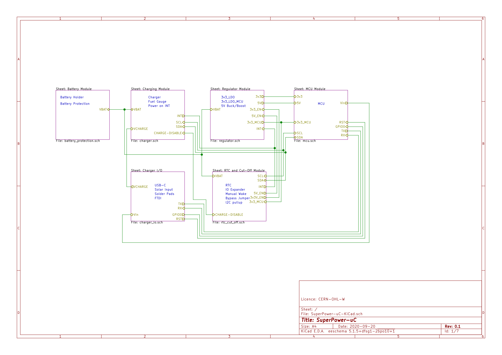
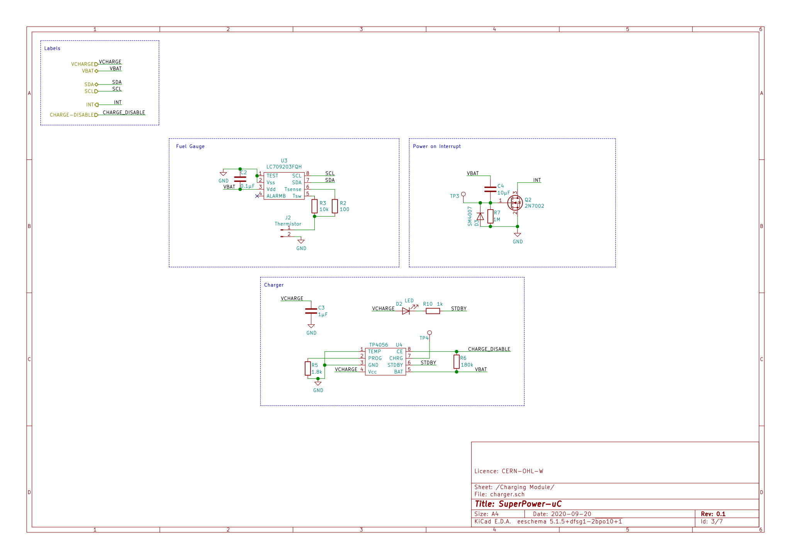
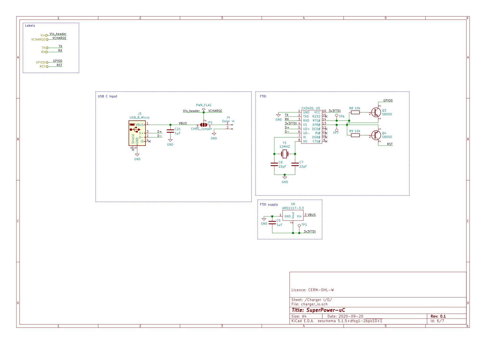
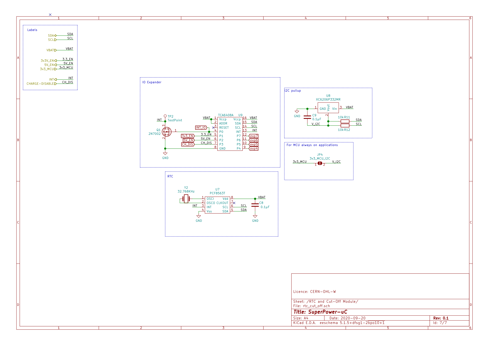
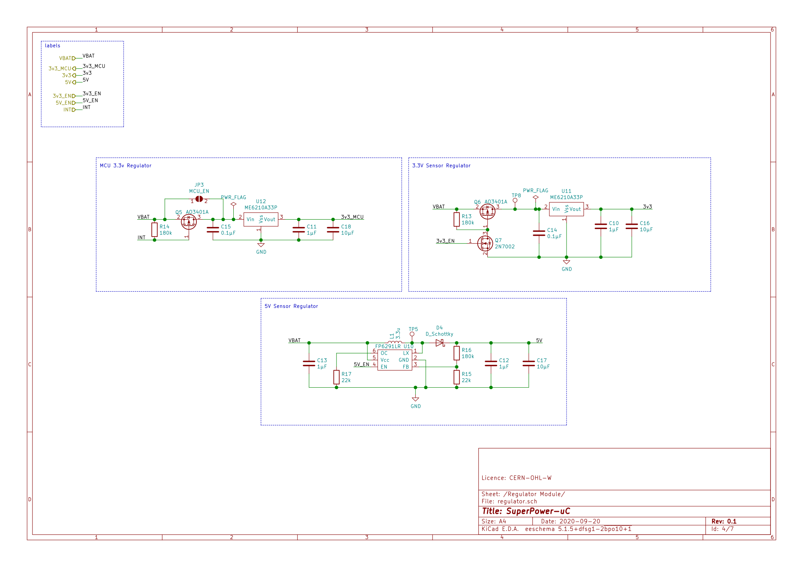
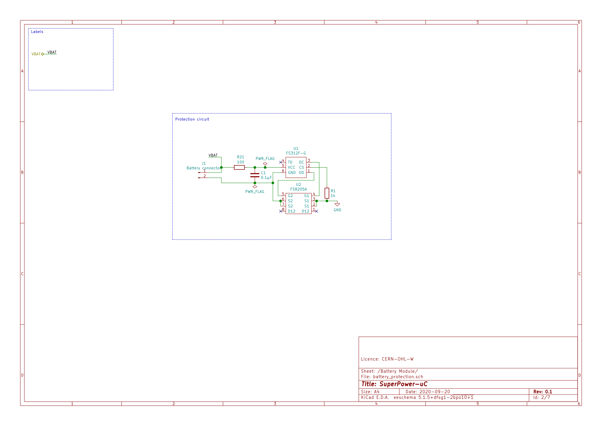

################
Low Cost Variant
################

The low cost variant is a variant with different and cheap components.
It does not fulfill the requirements 100% but still is low power.
Schematics
~~~~~~~~~~

Top View
++++++++

Charging Module
+++++++++++++++

Charger IO
++++++++++

RTC cut-off
+++++++++++

MCU
+++

.. image:: ../../../.generated/SuperPower-uC/lowcost/schematics/l_mcu.svg

Regulator
+++++++++

Battery Protection
++++++++++++++++++

Bill of Main IC Components
--------------------------

.. csv-table:: Bill Of Materials
   :file: low-cost-BOM-Main.csv
   :header-rows: 1

Full Bill of Materials
----------------------

.. csv-table:: Bill Of Materials
   :file: low-cost-BOM.csv
   :header-rows: 1
